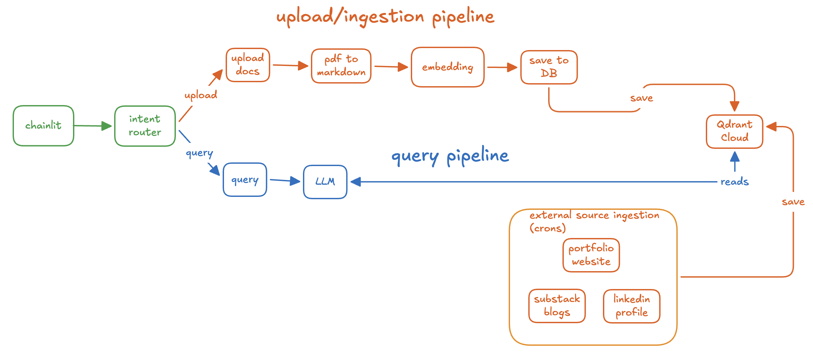
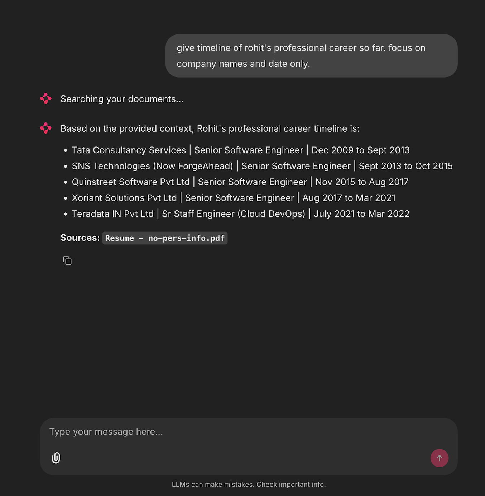
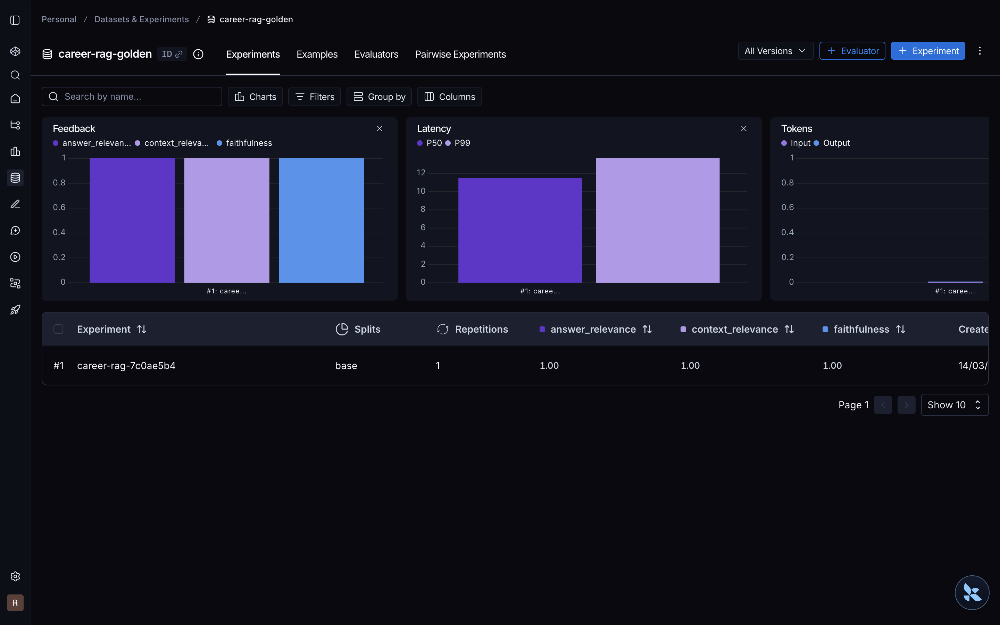
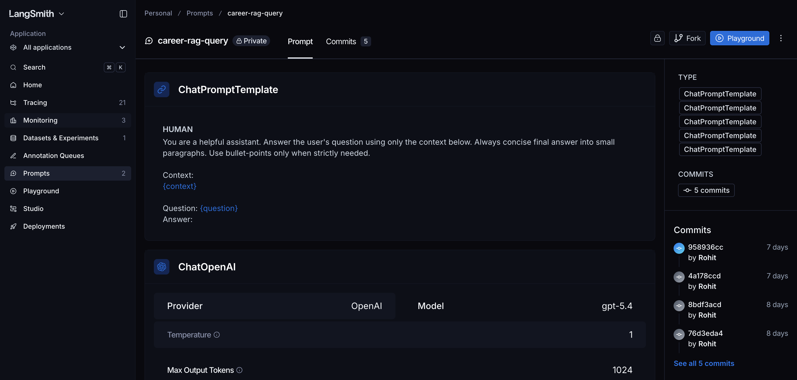
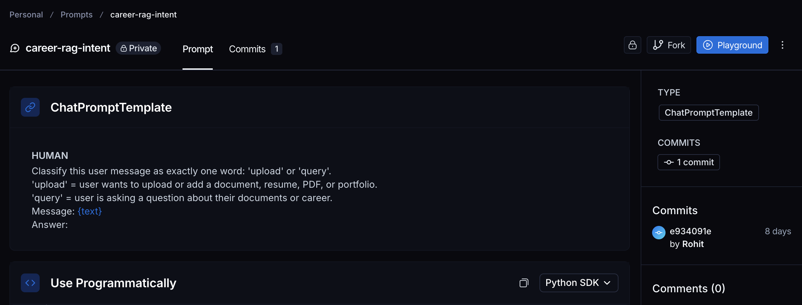
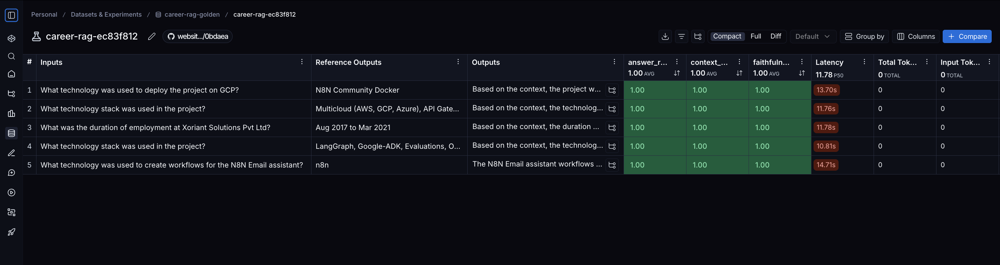
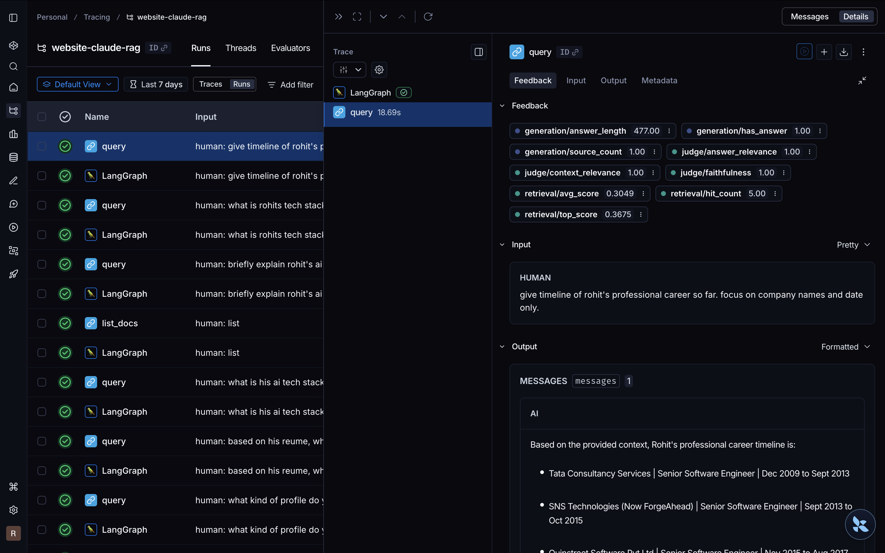

# Website RAG Assistant
I setup ingestion and query pipeline RAG chatbbot, so users to get information on my website I setup a RAG assistent to answer queries from select sources (uploaded resume, portfolio website, blogs, linkedin).

## Ingestion-Query Pipeline Flow

### Ingestion Pipeline
### Manual Upload (single files)
- Chainlit/Interface
  - User uploads source docs using chainlit interface
  - Intent router decides if upload or query
  - upload docs
  - embeddings, chunking - using openai-embedding-3-large model
  - save to vector DB - qdrant cloud
### Bulk Upload (multiple sources)
- Setup via cron jobs
- Ingests external sources
  - substack blogs
  - portfolio website
  - linkedin profile
### Query Pipeline
Ask questions via interface
- Query
- Intent classifier (upload/ query)
- Embdding
- Cosine search
- 

## Demo
Query, Citations

### Production Ready Features
- Obervability
  - Traces, Latency p50, P90
  - Inbuilt heuristic metrics
  - LLM as a judge metrics
- Evaluation, with golden datasets
- Central prompt management, versioning
- Evals on every commit w pre commit hooks, and skippable flags

## Evals on every commit w pre commit hooks, and skippable flags

## Traces Latency Overall

## Golden Dataset

## Central Prompt Management, Versioning

## Prompt Versioning

## Evaluations against golden dataset

## Feedbacks using rule-based, LLM as a judge metrics

## Optimisations
- HNSW configurations for faster embedding
- Faster inferences using Groq
- Open source models to minimise costs

<!-- Prompt Versioning
 -->

